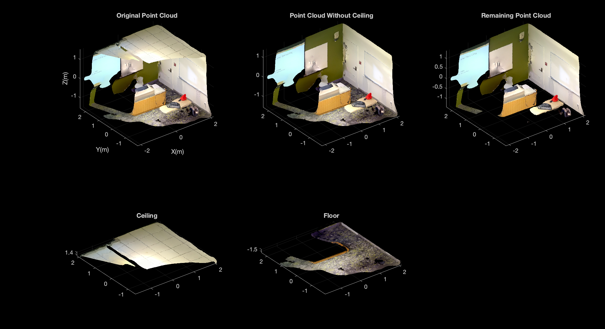
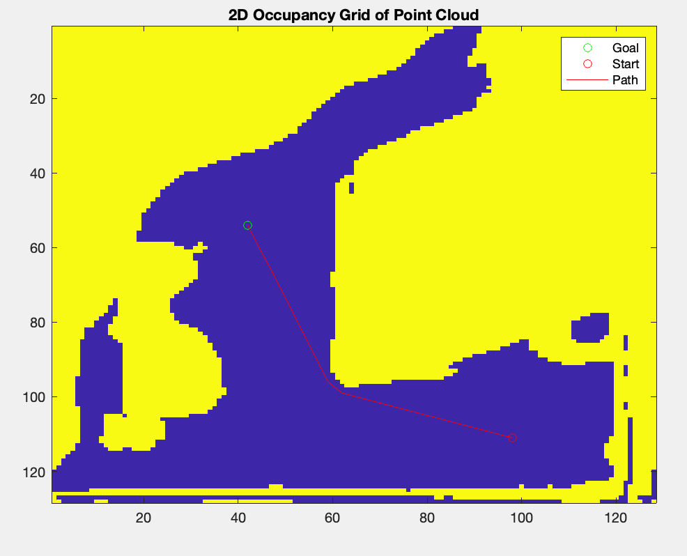

# 3D-Pathfinder

### MVP
** **
Provided a point cloud representation of a room (generated using a LiDAR scanner), our system may take in this point cloud and allow a user to select a start and end point. Our pathfinder will then automatically generate a path along the floor of the room, avoiding any real-world obstacles that may block the user's path. The user will then be provided with a visual representation of the path in 3D space utilizing the originally provided point cloud.  

### Current Architecture
- 3D Point Cloud as input.
- Points are binned in 2D space to generate 2D occupancy grid.
  - Cells are 1 if occupied (contains points above z=0) and 0 if free.
- The user selects a start point and goal point from a top-down view of the point cloud.
- A* pathfinder is used to find a path along the 2D spaces that avoids occupied bins.
- If a path is found, the 3D representation of the room is modified to show the path, coloring sets of points that are included in the path, and is presented back to the user.

### Astar Path Generation
** **
Credit to: [Einar Ueland](https://github.com/EinarUeland/Astar-Algorithm).

A* Search Algorithm picks the node according to a value - ‘f’ at each step which is a parameter equal to the sum of two other parameters – ‘g’ and ‘h’. At each step it picks the node/cell having the lowest ‘f’ and processes that node/cell.

g = the movement cost to move from the starting point to a given square on the grid, following the path generated to get there. 

h = the estimated movement cost to move from that given square on the grid to the final destination. 

Diagonal distance to initialize heuristic and use F=G+H to evaluate the cost of the path; the smaller the F is, the lower the cost.

We also create two lists – Open List and Closed List. Open List is used to store the points which could be reached in the next step, and Closed List is used to store the points with the lowest cost that have already been used. The lowest cost point in Open List is always chosen as the parent point. If that point has already existed in Closed List or it is invalid (an occupied/barrier cell), we ignore it and continue. Once the end point is added to Open List, all the parent points are traced back to generate the shortest path.

### Limitations
** **
- Areas missed by an incomplete scan are assumed to be obstacle areas. Therefore, a path will not be generated along areas missed by a LiDAR scan. 
- Obstacles that may be stepped over, rather are assumed to be completely blocking. Therefore, no path will made along an area that includes any obstacles above floor height, regardless of how low they are. 
- Due in part to the above limitation, scans are limited to single floor spaces, and therefore paths cannot traverse stairs
- As points are binned together, some resolution is lost when generating the path, and therefore the path loses some degree of accuracy when represented visually. The higher the resolution the scan, the better the path, and vice versa.

### Repo organization
** **
Currently all code can be found in /source, with all required files to run the code, except the input point cloud.

The code can be run simply by running main.m with a *.ply file in the same directory. The name of the file must be modified in main.m to take in the correct point cloud, with the default being "point_cloud.ply". There is also a boolean value has_ceiling that must be set to true (as it is by default) if the scan of the room contains a ceiling.

Toolboxes Required For Running:
- Computer Vision Toolbox

### Example

The following is an example using the corner of clasroom, with a ceiling and missing parts of the scan. The rest of the scan has many points aallowing for a more detailed path.

#### Original point cloud + floor and ceiling pieces taken out:

#### 2D Occupancy Grid Generaated for A* Search:

#### 3D Point Cloud (w/out ceiling) with optimal path in red:

